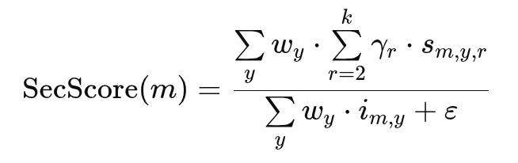
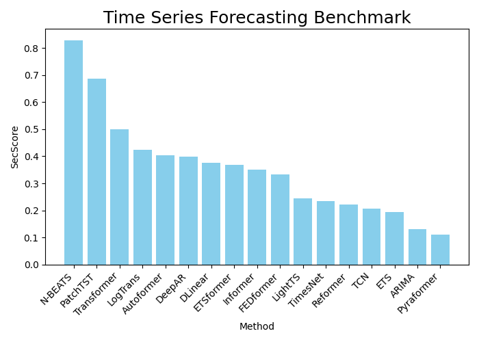

# Second Chance: Identifying the Best Method in Research Benchmarks

Every paper highlights its own method as the best, because no one gets published unless their method beats all others. This may create a biased benchmark: setups are tuned, results cherry-picked, and baselines under-tuned. So how can we find the real best method?

Here, we track who comes in second. Second-place methods come with minimal bias - they aren’t optimized by the authors, yet still perform near the top. If a method consistently ranks second across many papers, it may be the true best. That’s the idea behind the **SecScore**.


## Score

**SecScore** per method considers:

- Count of second-place appearances
- Divided by total number of appearances to normalize for popularity
- Rank weighting: appearances at 3rd, 4th, etc., can be included with decreasing weights (optional)
- Recency weighting: more recent results weight more than older ones to reflect evolving benchmarks (optional)

This results in a score between 0 and 1, where a higher score suggests a strong candidate for the true best method.



where:
- m = the method being scored  
- k = highest rank to consider (inclusive)  
- y = publication year of the paper reporting the benchmark  
- r ∈ {2, ..., k} = rank position  
- wᵧ = time decay weight for year y  
- γᵣ = rank weight for position r  
- s₍m,y,r₎ = number of times method m ranked r in year y  
- i₍m,y₎ = number of times method m appeared in any rank in year y  
- ε = small constant to prevent divide-by-zero


## Example

Many machine learning methods have been proposed for time series forecasting. Based on 34 papers from recent years, we applied **SecScore** to identify the best methods. The results:




## Code

- `content.py` reads papers from URLs and extracts tables and their legends.
- `benchmarks.py` uses an OpenAI model to identify and rank methods in each table from best to worst.
- `ranking.py` aggregates benchmark results across multiple papers.
- `score.py` implements the **SecScore** calculation.
- `main.py` calls the above scripts to extract, rank, score, and plot the results for a set of papers.


## Run

```bash
git clone https://github.com/JuditHalperin/second-chance.git
cd second-chance
pip install -r requirements.txt
```

```bash
python main.py \
  --papers example/time_series_forecasting_benchmark.csv \
  --plot example/time_series_forecasting_benchmark.png \
  # include 2nd, 3rd and 4th place rankings:
  --rank 4 \
  # require at least 6 appearances for a method to be scored:
  --min_count 6
```
